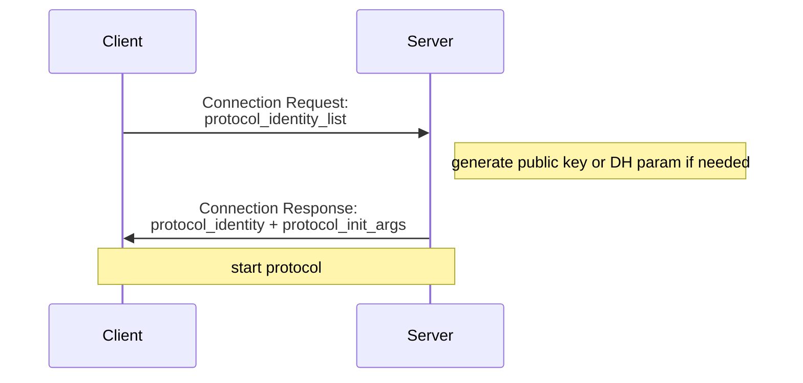

# プロジェクト

## 目標
通信モデルを作って暗号の安全性の検証をする．

## javaバージョン
Java17 - OpenJDK 17

# ドキュメント

## project
ルートパッケージ

## project.lib
ライブラリの定義を入れるパッケージ．

このパッケージ直下のクラスは暗号，プロトコル共通で用いられる

## project.lib.crypto
暗号の定義を入れるパッケージ

## project.lib.protocol
プロトコルの定義を入れるパッケージ

### project.lib.protocol.Ion
オブジェクトを文字列表現する記法として，':'を文字列キーとオブジェクトの関連付け，'='を文字列キーと文字列の関連付けに利用し，兄弟を表すのに'&'を利用する記法として，
Inline Object Notation = IONを定義した．
```ebnf
      ION ::= RuleSet | Atom;
      Key ::= "[_a-zA-Z0-9]+";
  RuleSet ::= Rule, ('&', Rule)*;
     Rule ::= AtomRule | RecRule;
ArrayRule ::= Key, '|' Rule, ('+', Rule)*, ';';
  RecRule ::= Key, ':', RuleSet, ';';
 AtomRule ::= Key, '=', Atom;
     Atom ::=  "[^;&+\n]+";

```

サンプル: `key0:key01:key011=v010&key012=esc"ape;&key02|key021=v021&key022=v022+key023=v023;;&key1=v1\n`
これが表すデータは
```yaml
key0:  
  key01: 
    key011: v001
    key012: esc"ape
  key02:
    - { key021:v021, key022:v22 }
    - { k023:v023 }
key1: v1
```

制御文字等はエスケープする．
`'\', ('d' | 'x'), number, 'n'`
ex) \d0000n or \d000n
dが先頭なら10進数解釈，xが先頭なら16進数解釈

### project.lib.protocol.MetaMessage
```ebnf
MetaMessage ::= Id, "@", ION, "\n";
         Id ::= "[_a-zA-Z][_a-zA-Z0-9]*";
```

meta protocol diagram


## project.test
エントリポイントなど実行にかかわるものを入れるパッケージ